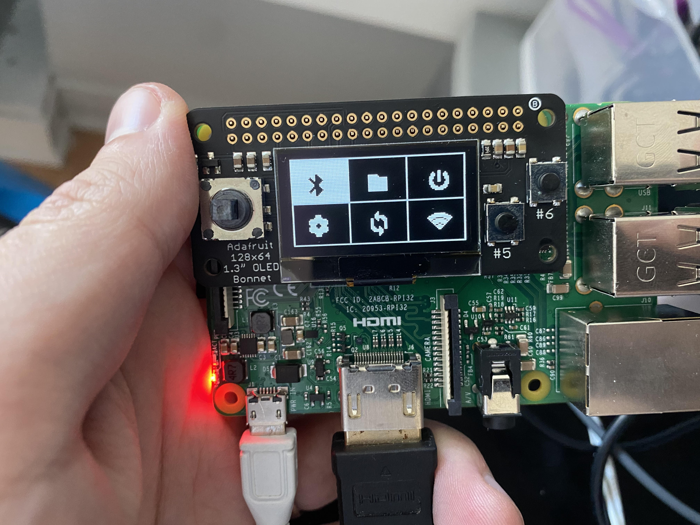
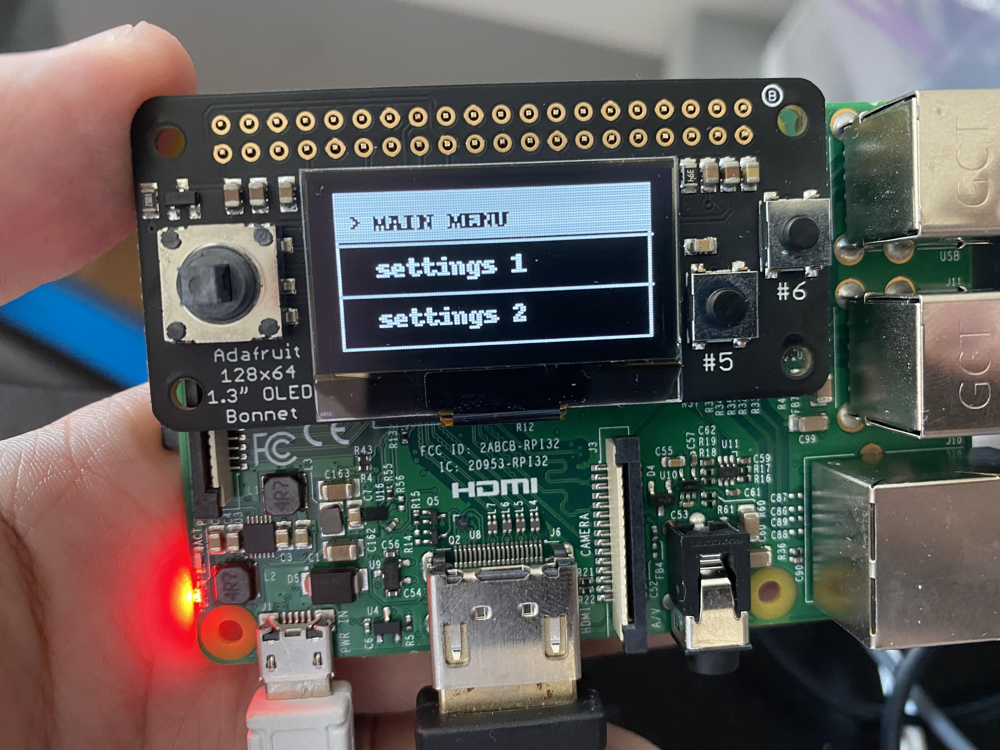

# Raspberry Pi OLED

This code was developed specifically for the [Adafruit 128x64 OLED Bonnet for the Raspberry Pi](https://www.adafruit.com/product/3531).

It can, however, be run in a tkinter window for prototyping ideas without the required hardware.

## System Architecture

The architecture design was meant to provide extensible components, a highly configurable nested menu system, settings interfaces, and customizable components for displaying and manipulating data.

There is a central `ApplicationState` class that manages event dispatching and listening. It takes a configuration instance of `ApplicationConfig` that contains initialized components and application logic.

When a `Button` input is received to the `ApplicationState.update` function, it passes the event through to the currently displayed component, which should render a `TkImage` to be emitted back to the `ApplicationState` instance by calling `emit_event('image', image)`. This image will be forwarded to whichever display medium is connected.

There are several other events that can be emitted with the `emit_event()` function of the `Component` subclasses.

## Examples

Example screens of the application running on the OLED attachment

    

 

    

